# sPHENIX Calorimeter Commissioning, Reconstruction, and Calibration

Substantial work on calorimeter commissioning, reconstruction, and calibration was required before producing high-quality physics results using the sPHENIX calorimeters.  
This commissioning effort included the design and deployment of **real-time monitoring and logging infrastructure** for calorimeter detector state, as well as investigations into reconstruction issues related to readout electronics.

---

## Real-Time Calorimeter State Logging and Monitoring

Each calorimeter sector contains six interface boards used to communicate with the detector for both configuration and monitoring.  
Each interface board is connected to:

- A slow-control communication board  
- A Multi-channel Power Output Device (MPOD)  
- A low-voltage power supply  
- An Analog-to-Digital Converter (ADC) board  

The slow-control communication board is responsible for setting and monitoring the detector state, including:

- SiPM temperatures  
- Low-voltage and bias-voltage set points  
- Tower-by-tower bias voltage offsets  
- Tower-by-tower SiPM leakage current  
- Pre-amplifier gain mode  

These boards are also used for commissioning tasks such as enabling LEDs and injecting test pulses for calibration runs.

---

## Calorimeter Control Architecture

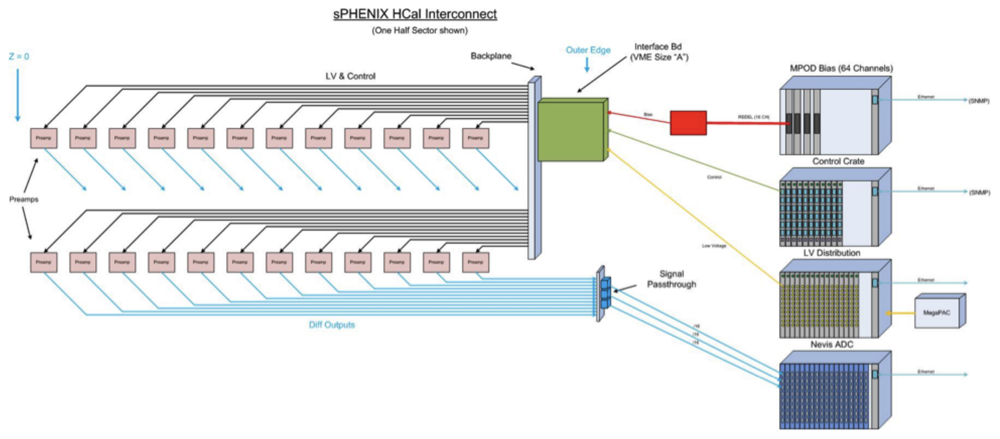

* Calorimeter sector communication design showing interface board connections to slow control, MPOD, low-voltage power, and ADC boards. Diagrams reproduced from the sPHENIX Technical Design Report.*

---

## Detector State Logging Infrastructure

Detector state information is critical for both online detector operation and offline reconstruction and calibration.  
For the EMCal and HCal, detector state information is logged in real time by:

1. Communicating with slow-control boards via telnet
2. Parsing detector state responses  
3. Writing parsed values to a PostgreSQL database via psycopg2  

Detector state has been logged at intervals of up to **every 10 minutes** for more than **three years of data taking**.

### Database Schema

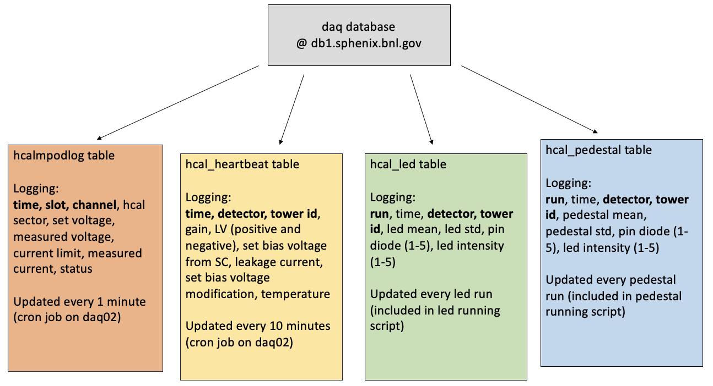

*Database schema used for logging HCal detector state, including slow-control data, bias voltage information, and LED/pedestal analysis results.*

Detector information is keyed by **offline tower ID** and **timestamp**, enabling direct access to tower-by-tower state during reconstruction and calibration.  
This structure supports temperature-dependent gain corrections and long-term stability monitoring.

**Implementation in sPHENIX core software:**

- Full integration into sPHENIX core software for use during reconstruction and calibration using odbc++ package  
  implemented in [sPHENIX coresoftware PR #2552](https://github.com/sPHENIX-Collaboration/coresoftware/pull/2552)

---

## Real-Time Monitoring Dashboards

Grafana dashboards provide both real-time and historical views of the detector state. 
Tower-level information is aggregated to present clear sector and half-sector summaries suitable for shift operations.

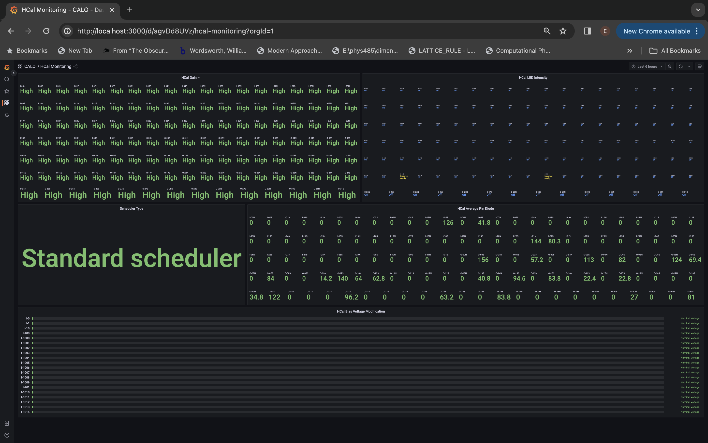

*Shifter-facing dashboard showing aggregated HCal gain, SiPM temperature, bias voltage offsets, LED, and pin-diode status.*

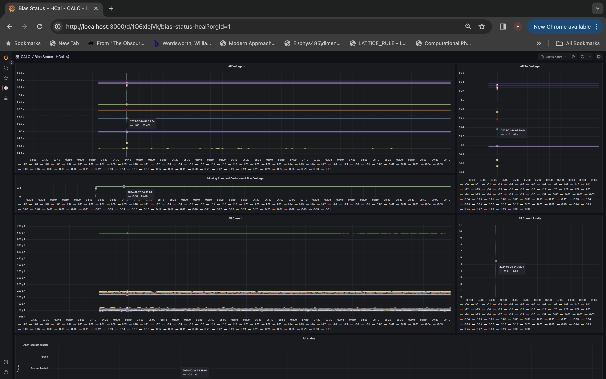

*Expert dashboard displaying sector-level bias voltage monitoring for the HCal.*

---

## sPHENIX Low-Level Data Reconstruction

During the first year of data taking, sPHENIX collected a commissioning dataset of Au+Au collision events.  
These data were used to exercise the full data production, reconstruction, and calibration chain.

Characteristic failure modes related to digitization and readout electronics were identified in the commissioning dataset.

---

## Diagnosing ADC Bit Issues

Calorimeter digitization is performed using legacy PHENIX digitizer boards. Each board:

- Reads differential analog signals from 64 channels  
- Uses an Analog Devices **AD9257** ADC chip  
- Digitizes signals with 14-bit precision  
- Streams serialized data to an **ALTERA Arria V GX FPGA** for optical readout  

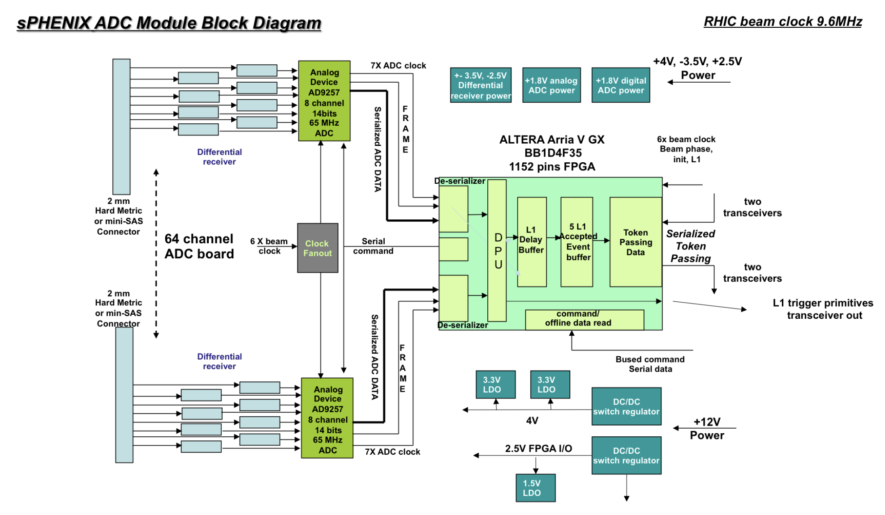

*ADC board design used for digitizing calorimeter signals.*

Two failure modes were observed in Run-2023 commissioning data:

1. **Persistent 2ⁿ ADC gaps**  
   - Present for a channel across an entire run  
2. **Intermittent stuck bits (bit flips)**  
   - Occurring sporadically throughout a run  

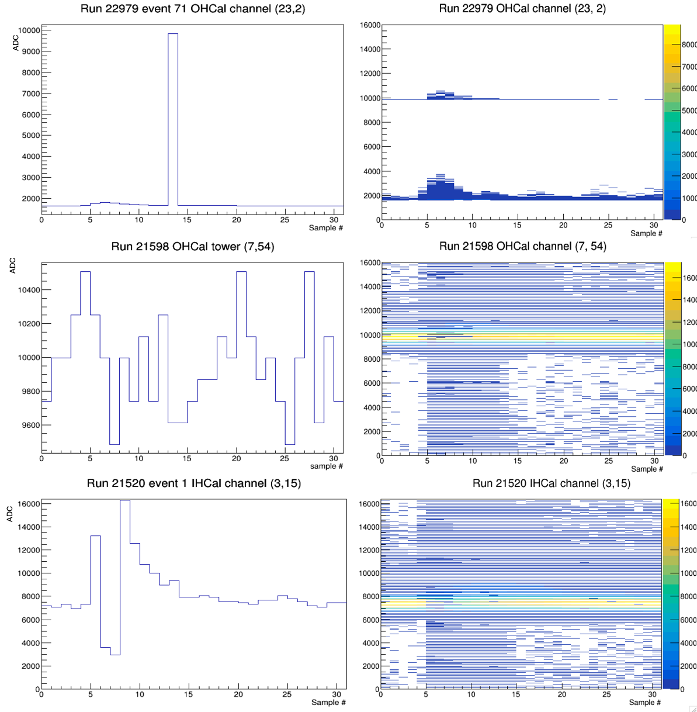

*Examples of abnormal waveforms exhibiting bit flips (top) and 2ⁿ ADC gaps (middle and bottom).*

---

## Online ADC Firmware Fixes

For channels exhibiting persistent 2ⁿ gaps, binary inspection showed that ADC bit streams were being shifted during readout.  
The number of shifted bits (*n*, 1–13) was constant per channel for an entire run.

The ADC configuration procedure included a fake-data test sequence for alignment but lacked a validation step, allowing mis-aligned ADCs to operate undetected.

### Firmware Fix

- Added validation of the fake-data alignment test  
- Automatically retries alignment if validation fails  

This fix resolved the shifted-bit waveform issue across all calorimeter channels.

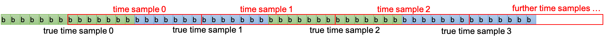

*Illustration of bit-stream shifts caused by ADC misalignment.*

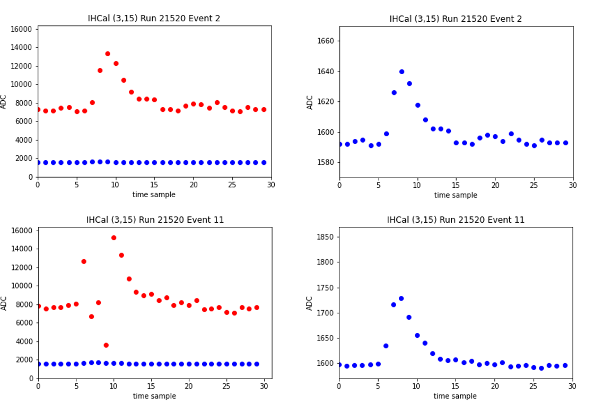

*Examples of abnormal shifted waveforms (red) and recovered waveforms after re-shifting (blue).*

---

## Offline Reconstruction Software Fixes

A small fraction (<0.1%) of ADC channels exhibited **intermittent stuck bits** due to hardware issues.  
Approximately 1% of events for these channels were affected in a given run.

In the default reconstruction chain, affected waveforms were masked using a template fit quality metric (χ²), as stuck-bit waveforms typically showed χ² values an order of magnitude higher than nominal.

---

## Waveform Recovery Strategy

To maximize calorimeter acceptance and reduce event-by-event variations, an offline waveform recovery algorithm was developed with a constrained scope:

- Targets single-sample stuck bits in high-value bits (2¹¹–2¹³)  
- Applies only to waveforms flagged by high χ²  
- Explicitly excludes shifted bit streams, abnormal shapes, and low-value stuck bits

Full integration of waveform recovery strategy into sPHENIX core software for use during calorimeter reconstruction implemented in [sPHENIX coresoftware PR #2889](https://github.com/sPHENIX-Collaboration/coresoftware/pull/2889)

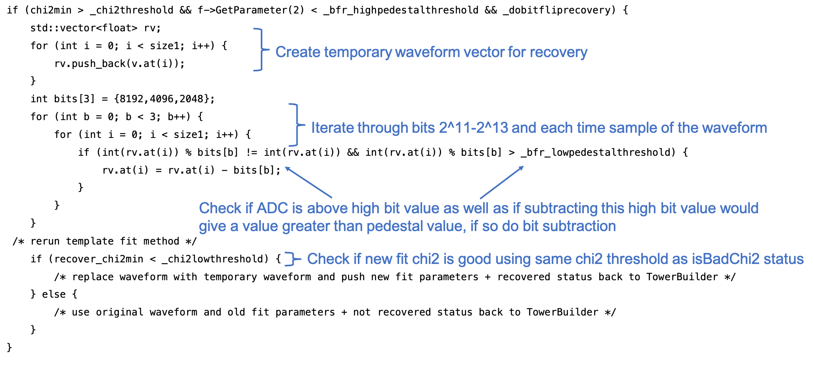

*Pseudo-code for identifying and recovering waveforms affected by high-value stuck bits.*

### Recovery Procedure

1. Identify candidate waveforms using χ² and pedestal values  
2. Iterate over bits 2¹¹–2¹³  
3. Subtract the bit value if:
   - The waveform sample exceeds the bit value  
   - The corrected value remains above pedestal  
4. Refit the waveform and re-evaluate χ²  

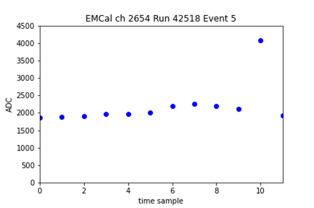
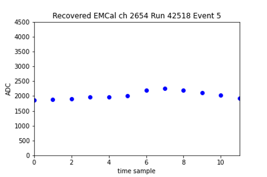

*Example waveform before (left) and after (right) stuck-bit recovery for an EMCal channel.*

Channels with shifted bit streams are excluded by requiring pedestal values < 4000 ADC.  
Recovered waveforms must also pass standard fit-quality criteria to ensure no reconstruction artifacts are introduced.

---

### Summary

This monitoring, logging, and reconstruction framework enables:

- Robust real-time detector health monitoring  
- Long-term calibration stability  
- Reliable mitigation of hardware-induced digitization failures  

The approach demonstrates how tightly integrated monitoring, database logging, and reconstruction logic can significantly improve detector performance and data quality.
