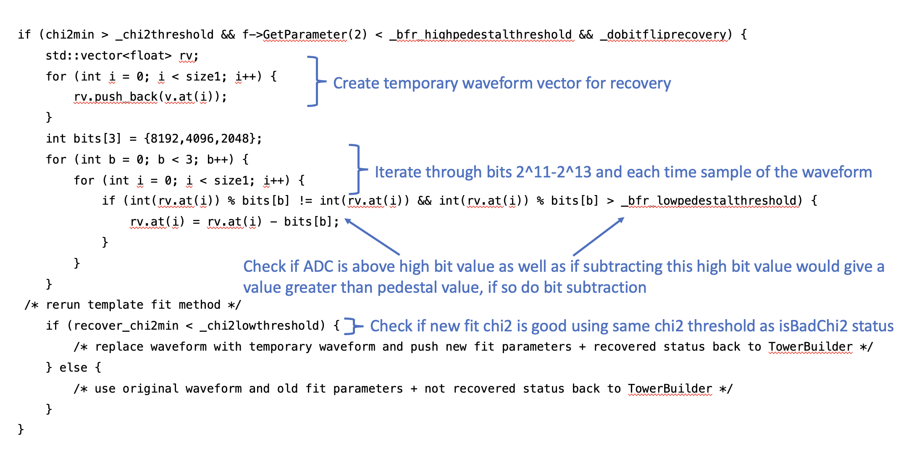
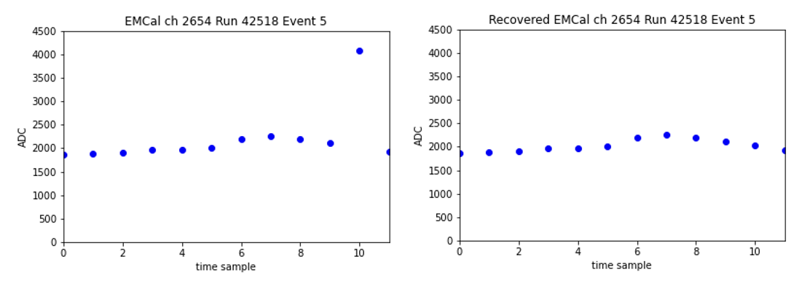

# Rare-Event Data Analysis in High-Volume Physics Data

## Project Overview

This project demonstrates **large-scale data analysis** applied to production physics data from the sPHENIX experiment.  
The goal was to **detect, quantify, and recover rare hardware-induced failures** in calorimeter readout electronics, using **millions of events** to ensure statistical rigor.

The work illustrates **data manipulation skills** including anomaly detection, large-scale data validation, feature engineering, statistical evaluation, and production-ready pipeline integration.

---

## Problem Statement

During commissioning, a small fraction of calorimeter channels exhibited **intermittent stuck-bit errors** in ADC waveforms:

- These failures affected **<0.1% of channels**
- Manifested as **sporadic spikes in high-value bits** (2¹¹–2¹³)
- Easily mis-interpreted as high-value rare physics processes
- Introduced event-by-event variability in downstream physics analyses

The challenge:

1. Develop methology for identifying rare failures in **hundreds of millions of waveform records**
2. Determine failure frequency and impact on data production pipeline
3. Develop a **recovery method** without introducing false positives or performace losses in waveform fitting procedure
4. Integrate the solution safely into production reconstruction workflows

---

## Data

- **5 million collision events**
- **245,760,000 calorimeter tower waveforms**
- **15 runs** selected from the last month of 2024 running 
- Features extracted:
  - χ² fit quality from waveform template
  - Pedestal values
  - Tower ID mapping
  - Bit-level waveform data

---

## Analytical Approach

1. **Exploratory Data Analysis**  
   - Aggregated tower-level waveform features across runs  
   - Identified abnormal patterns: persistent 2ⁿ gaps vs intermittent bit flips  

2. **Feature Engineering & Candidate Selection**  
   - Determined high χ² could be used to flag abnromal waveforms rare events  
   - Isolated known high-value stuck-bit towers and excluded ambiguous or shifted-bit channels using waveform pedestal thresholds  

3. **Algorithm Design**  
   - Rule-based recovery on single-sample stuck bits (2¹¹–2¹³)  
   - Iteratively subtract bit values if sample > threshold and above pedestal  
   - Refit waveform and evaluate χ² to confirm recovery  

4. **Validation & Metrics**  
   - Toggle recovery function on/off to compare outcomes  
   - Metrics captured:
     - True recovery rates
     - False positives / negatives
     - Precision and recall
     - Procedure time span 

---

## Results

| Metric | Result |
|--------|--------|
| Towers entering recovery logic | 4,105 per 245,760,000 towers |
| Successfully recovered towers | 857 per 245,760,000 towers |
| Known bit-flip towers recovered | **99.997%** |
| Random bit-flip false recoveries | 7 / 5M events (**0.002%**) |
| False positives | 2 / 5M events (**0.0005%**) |
| False negatives | 5 / 5M events (**0.001%**) |
| Fitting procedure time | No change ( << procedure time variance across systems) |

**Key Insights:**

- Recovered almost all known failures while **maintaining extremely low false-positive rates**  
- Statistical rigor ensured reliability at production scale  
- Demonstrated that **rare-event detection is feasible with structured, high-volume data analysis**

---

## Visualizations

*Pseudo-code workflow for detecting and recovering high-value stuck bits.*

*Example waveform before (left) and after (right) recovery.*

---

## Tools & Technologies

- C++, ROOT and HTCondor for high-volume large scale event processing
- Python (pandas, NumPy, matplotlib) for waveform analysis  
- GitHub for version control and documentation  
- Statistical metrics for validation (precision, recall, false-positive/negative rates)  

---

## Impact & Takeaways

-  Developed **methodology for rare event failure detection** using features extracted from nominal data production pipeline
-  Enabled **safe recovery of rare corrupted data**, preventing the misclassification of background as rare high-value physics and increasing usable calorimeter events  
- Quantified recovery performance at **scale (millions of events)**  
- Applied **data-driven, reproducible methods** in a production pipeline  

---

## Repository Links

- Full integration into sPHENIX core software: [PR #2889](https://github.com/sPHENIX-Collaboration/coresoftware/pull/2889)
